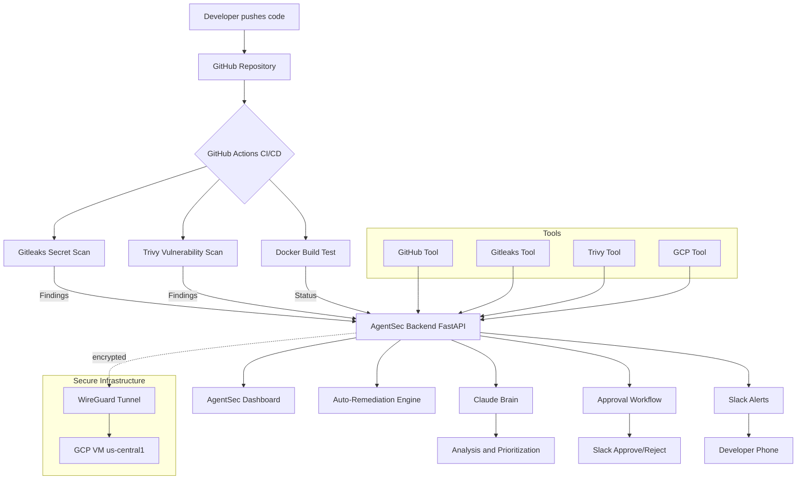

# AgentSec 🛡️

### Autonomous DevSecOps Agent — by ashNikov Technologies

> AI-powered security monitoring, secret detection, vulnerability scanning, auto-remediation, and real-time Slack alerting across your entire GitHub and cloud infrastructure — fully autonomous.

---

## What is AgentSec?

AgentSec is an autonomous DevSecOps agent that watches your GitHub repositories and cloud infrastructure 24/7. It doesn't just **detect** security issues — it **fixes** them. It scans for exposed secrets, vulnerabilities, and misconfigurations, then autonomously remediates them with human approval for high-risk actions, all while firing real-time alerts to your Slack channel.

Every startup and solo developer deserves enterprise-grade DevSecOps — not because they can afford a $150k/year security engineer, but because AgentSec works for them around the clock.

**Status:** Phase 1 Complete | Phase 2 Complete | Phase 3 Complete ✅ | Phase 4 Next

---

## Key Capabilities

- **Multi-Repo Scanning** — dynamically scans every repository in your GitHub org, auto-discovers new repos instantly
- **Secret Detection** — Gitleaks scans for exposed API keys, tokens, and credentials
- **Vulnerability Scanning** — Trivy detects CVEs across filesystems and Docker images
- **Cloud Security** — monitors GCP IAM, Cloud Run, and Storage for misconfigurations
- **Auto-Remediation** — rotates secrets, fixes risky IAM bindings, hardens Dockerfiles, flags vulnerable dependencies
- **Approval Workflow** — high-risk actions require human approval via Slack and dashboard
- **Encrypted Networking** — WireGuard VPN tunnel between agent and cloud infrastructure
- **Scheduled Scanning** — autonomous scans every 6 hours with AI-prioritized reporting
- **Real-Time Alerts** — instant Slack push notifications to your phone

---

## Architecture



---

## Agent Flow

```mermaid
sequenceDiagram
    participant Dev as Developer
    participant Agent as AgentSec
    participant Brain as Claude Brain
    participant Slack as Slack

    Dev->>Agent: Trigger scan (manual or scheduled)
    Agent->>Agent: Scan all repos via GitHub API
    Agent->>Agent: Run Gitleaks + Trivy
    Agent->>Agent: Check GCP IAM bindings
    Agent->>Brain: Send aggregated findings
    Brain->>Brain: Analyze and prioritize
    Brain-->>Agent: Prioritized report
    Agent-->>Slack: Per-repo breakdown + analysis
    Slack-->>Dev: Push notification

    Note over Agent,Slack: High-risk remediation
    Agent-->>Slack: Approval Required - rotate secret?
    Dev->>Slack: APPROVE / REJECT
    Slack->>Agent: Decision
    Agent->>Agent: Execute or abort

---

## Tech Stack

| Layer | Technology | Purpose |
|-------|-----------|---------|
| Agent Brain | Claude Sonnet + Haiku + Python Judge | Multi-agent reasoning and decision making |
| Backend | FastAPI + Python 3.12 | API server and agent orchestration |
| Frontend | Next.js 16 + TypeScript | Live monitoring dashboard |
| Auth | GitHub OAuth + JWT + Email/Password | Secure auth with short-expiry tokens |
| Secret Scanner | Gitleaks | Detect exposed API keys and secrets |
| Vulnerability Scanner | Trivy | Scan containers and filesystems |
| GitHub Integration | PyGitHub | Repository monitoring and scanning |
| Cloud | GCP (Cloud Run, IAM, Secret Manager) | Infra scanning and secret storage |
| Networking | WireGuard | Encrypted tunnel between agent and cloud |
| Alerting | Slack Webhooks + Interactive Buttons | Real-time alerts + approval workflow |
| CI/CD | GitHub Actions | Automated security pipeline on every push |
| IaC | Terraform + Ansible | Provisioning and configuration management |
| Database Migrations | Alembic | Schema versioning and rollback |
| Billing | Paystack | Subscription billing, Free/Pro plans |
| Container | Docker | Portable deployment |

---

## Engineering Standard

> Every resource provisioned with Terraform. Every configuration managed with Ansible. Nothing touched manually. Everything version controlled. Everything repeatable. Everything rollbackable.

---

## Features

### Phase 1 — Detection (Complete)
- GitHub repository monitoring, auto-discovers new repos
- Secret detection with Gitleaks across entire codebase
- Vulnerability scanning with Trivy (filesystem + Docker images)
- GCP cloud identity and IAM monitoring
- FastAPI backend with full tool integration
- Next.js dashboard with animated radar
- Docker containerization
- GitHub Actions CI/CD - 3-job pipeline
- Claude brain wired to all tools
- Real-time Slack alerts

### Phase 2 — Remediation (Complete)
- GitHub OAuth + JWT authentication (30-min expiry, silent refresh)
- Rate limiting, CORS lockdown, input validation, HTTPS middleware
- All secrets migrated to GCP Secret Manager
- Auto-remediation engine - secret rotation, IAM fixes, Dockerfile hardening
- Scheduled scanner - autonomous scans every 6 hours
- Mad Interactive UI - cyber mission control dashboard
- Multi-repo scanning - dynamic, scales to any number of repos
- Approval workflow - Slack + dashboard APPROVE/REJECT with audit trail
- WireGuard layer - encrypted tunnel to GCP infrastructure

### Phase 3 — Building Agent + SaaS Foundation (Complete ✅)
- ✅ CI/CD hardening — SonarCloud SAST, SARIF upload, PR gates, 5/5 tools active
- ✅ Auto-provisioning — agent adds CI/CD, gitignore, branch protection, compliance board
- ⏸ AWS integration — DEFERRED (account inactive)
- ✅ Multi-agent brain — Haiku + Sonnet + Python Judge
- ✅ SaaS foundation — 16-table schema, Paystack billing, Slack interactive approvals, audit logs

### Phase 4 — Full DevSecOps Engineer (Planned)
- Multi-cloud (AWS + GCP + Azure)
- Kubernetes security, HashiCorp Vault
- SOC2 / ISO27001 / CIS compliance
- SAST + DAST scanning
- Automated executive reporting

---

## Project Structure

```
devsec-agent/
├── backend/
│   ├── agent/
│   │   ├── core.py           # Agent brain + multi-repo scanning
│   │   └── scheduler.py      # Autonomous scheduled scanner
│   ├── tools/
│   │   ├── github_tool.py    # GitHub integration
│   │   ├── gitleaks.py       # Secret scanning
│   │   ├── trivy.py          # Vulnerability scanning
│   │   ├── gcp.py            # GCP cloud scanning
│   │   ├── slack.py          # Slack alerting
│   │   ├── remediation.py    # Auto-fix engine
│   │   └── approval.py       # Approval workflow store
│   ├── auth/
│   │   └── jwt_handler.py    # JWT token management
│   ├── api/
│   │   └── main.py           # FastAPI server
│   ├── Dockerfile
│   └── requirements.txt
├── frontend/
│   └── app/
│       ├── page.tsx          # Main dashboard
│       ├── layout.tsx        # App layout
│       └── globals.css       # AgentSec dark theme
├── terraform/                # Infrastructure as Code
│   ├── main.tf               # GCP resources + WireGuard VM
│   ├── variables.tf
│   ├── providers.tf
│   └── outputs.tf
├── ansible/                  # Configuration management
│   ├── inventory.ini
│   └── playbooks/
│       ├── setup.yml
│       ├── configure_secrets.yml
│       └── wireguard.yml     # WireGuard tunnel config
├── .github/
│   └── workflows/
│       └── security.yml      # CI/CD security pipeline
└── README.md
```

---

## Quick Start

### Prerequisites
- Python 3.12+
- Node.js 22+
- Docker
- gcloud CLI
- Terraform + Ansible
- Gitleaks + Trivy

### 1. Clone the repo
```bash
git clone https://github.com/ashNikov/devsec-agent.git
cd devsec-agent
```

### 2. Set up backend
```bash
cd backend
python3 -m venv venv
source venv/bin/activate
pip install -r requirements.txt
```

### 3. Configure environment
```bash
cp .env.example .env
```

Required keys:
ANTHROPIC_API_KEY=your_key
GITHUB_TOKEN=your_token
GITHUB_CLIENT_ID=your_oauth_client_id
GITHUB_CLIENT_SECRET=your_oauth_client_secret
GCP_PROJECT_ID=your_project_id
SLACK_WEBHOOK_URL=your_webhook_url

### 4. Provision infrastructure (Terraform)
```bash
cd terraform
terraform init
terraform plan
terraform apply
```

### 5. Configure with Ansible
```bash
cd ../ansible
ansible-playbook -i inventory.ini playbooks/setup.yml
```

### 6. Start the backend
```bash
cd ../backend
uvicorn api.main:app --reload --port 8000
```

### 7. Start the frontend
```bash
cd ../frontend
npm install
npm run dev
```

### 8. Open the dashboard
Navigate to http://localhost:3000 and log in with GitHub.

---

## About

**AgentSec** is built by **ashNikov Technologies**.

GitHub: [@ashNikov](https://github.com/ashNikov)

> *"Security shouldn't be an afterthought. AgentSec makes it automatic."*

---

## License

MIT License — feel free to use, modify, and build on this.
