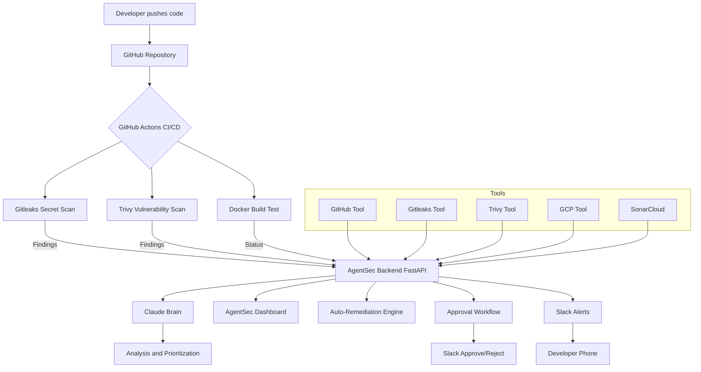
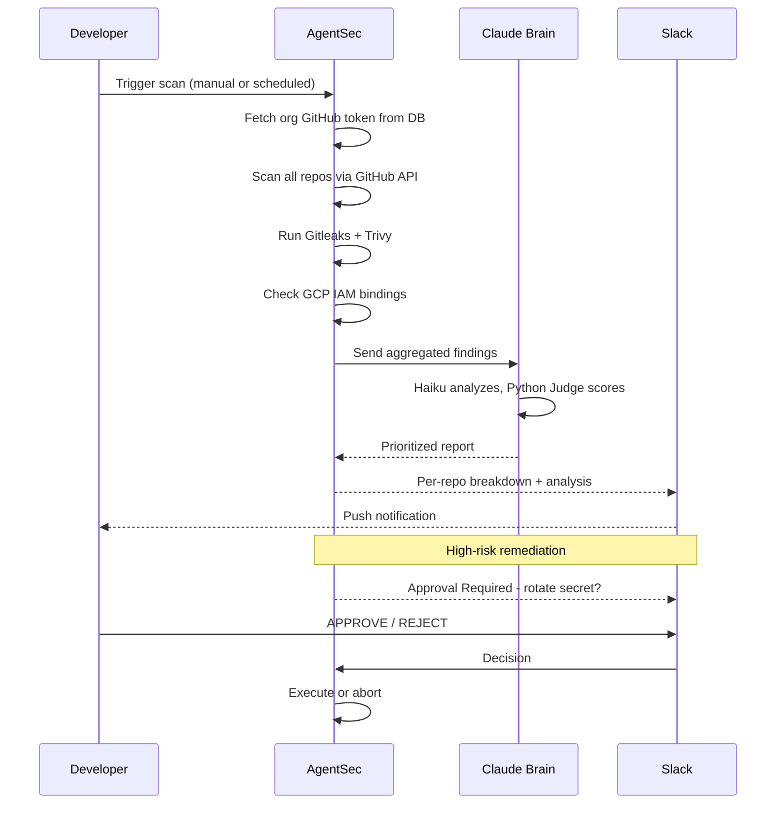

# AgentSec 🛡️

### Autonomous DevSecOps Agent — by ashNikov Technologies

> AI-powered security monitoring, secret detection, vulnerability scanning, auto-remediation, and real-time Slack alerting across your entire GitHub and cloud infrastructure — fully autonomous.

---

## What is AgentSec?

AgentSec is an autonomous DevSecOps agent that watches your GitHub repositories and cloud infrastructure 24/7. It doesn't just **detect** security issues — it **fixes** them. It scans for exposed secrets, vulnerabilities, and misconfigurations, then autonomously remediates them with human approval for high-risk actions, all while firing real-time alerts to your Slack channel.

Every startup and solo developer deserves enterprise-grade DevSecOps — not because they can afford a $150k/year security engineer, but because AgentSec works for them around the clock.

**Status:** Phase 1 ✅ | Phase 2 ✅ | Phase 3 ✅ | Phase 4 ✅ | Phase 5 🔄 IN PROGRESS (90%)

**Live at:** https://www.ashtech.app

---

## Commercial Focus

> **Automatically detect and remediate exposed secrets + cloud misconfigurations for small engineering teams.**

**Free Plan:** 1 repo, scan only, no auto-remediation, up to 3 members

**Pro Plan (NGN 15,000/month):** Unlimited repos, auto-remediation, scan history, multi-agent brain analysis

---

## Key Capabilities

- **Multi-Repo Scanning** — dynamically scans every repository in your GitHub org
- **Secret Detection** — Gitleaks scans for exposed API keys, tokens, and credentials
- **Vulnerability Scanning** — Trivy detects CVEs across filesystems and Docker images
- **Cloud Security** — monitors GCP IAM, Cloud Run, and Storage for misconfigurations
- **Auto-Remediation** — rotates secrets, fixes risky IAM bindings, hardens Dockerfiles
- **Approval Workflow** — high-risk actions require human approval via Slack and dashboard
- **Multi-Agent Brain** — Claude Haiku + Sonnet + Python Judge for AI-powered analysis
- **Scheduled Scanning** — autonomous scans every 6 hours with AI-prioritized reporting
- **Real-Time Alerts** — instant Slack push notifications to your phone
- **SaaS Multi-Tenant** — full org isolation, per-org GitHub token, AES-256 encrypted token storage
- **Paystack Billing** — Free and Pro subscription plans (NGN 15,000/month)

---

## Architecture



---

## Agent Flow



---

## Tech Stack

| Layer | Technology | Purpose |
|-------|-----------|---------|
| Agent Brain | Claude Sonnet + Haiku + Python Judge | Multi-agent reasoning and decision making |
| Backend | FastAPI + Python 3.12 | API server and agent orchestration |
| Frontend | Next.js 16 + TypeScript | Live monitoring dashboard |
| Auth | GitHub OAuth + JWT + Email/Password | Secure auth with 30-day persistent login |
| Database | PostgreSQL (GCP Cloud SQL) | 17-table SaaS schema |
| ORM/Migrations | SQLAlchemy + Alembic | Schema versioning and rollback |
| Secret Scanner | Gitleaks v8.18.2 | Detect exposed API keys and secrets |
| Vulnerability Scanner | Trivy v0.70.0 | Scan containers and filesystems |
| SAST | SonarCloud | Static code analysis |
| GitHub Integration | PyGitHub | Repository monitoring and scanning |
| Token Security | AES-256 (Fernet) | Encrypted GitHub tokens at rest |
| Cloud | GCP (Cloud Run, Cloud SQL) | Hosting, DB, scanning |
| Alerting | Slack Webhooks + Interactive Buttons | Real-time alerts + approval workflow |
| CI/CD | GitHub Actions | Auto-deploy backend + frontend on every push |
| IaC | Terraform + Ansible | Provisioning and configuration management |
| Billing | Paystack | Subscription billing, Free/Pro plans |
| Email | Resend | Team invites, password reset |
| Error Tracking | Sentry + structured logging | Production error monitoring |
| Frontend Hosting | Vercel | Auto-deploy from GitHub |
| Domain | ashtech.app (Cloudflare) | Custom domain, SSL |

---

## Phase Progress

### Phase 1 — Detection ✅
- GitHub repo monitoring, Gitleaks, Trivy, GCP IAM monitoring
- FastAPI backend, Next.js dashboard, Docker, GitHub Actions CI/CD
- Claude brain wired to all tools, real-time Slack alerts

### Phase 2 — Remediation ✅
- GitHub OAuth + JWT auth (30-day persistent login)
- Rate limiting, CORS lockdown, input validation, HTTPS
- Auto-remediation engine — secret rotation, IAM fixes, Dockerfile hardening
- Scheduled scanner — autonomous scans every 6 hours
- Approval workflow — Slack + dashboard APPROVE/REJECT with audit trail

### Phase 3 — SaaS Foundation ✅
- CI/CD hardening — SonarCloud SAST, SARIF upload, PR gates, 5/5 tools active
- Multi-agent brain — Haiku + Sonnet + Python Judge with scoring system
- Complete 17-table PostgreSQL schema with Alembic migrations
- Email/password registration + JWT auth (org_id/role/plan claims)
- Paystack billing integration — webhook, plan enforcement, subscription management
- All 5 scanners ACTIVE on staging

### Phase 4 — Full SaaS Dashboard ✅
- Complete Next.js App Router SaaS UI — 6 dashboard pages + Admin panel
- UI wired to live backend data (repos, findings, scan history, team, billing, settings)
- Invite flow — real email via Resend
- Brain result auto-saving to scan history DB
- Vercel deployment — auto-deploys on push
- Scan history page + repo trend badges
- Sentry error tracking + structured Python logging
- GitHub webhook + background repo sync every 2 minutes
- agentsec.config.json as single source of truth

### Phase 5 — Production + YC W2027 Launch 🔄 (90%)
- ✅ ashtech.app domain live — Cloudflare → Vercel, SSL, Chrome warning eliminated
- ✅ Landing page — hero, how it works, pricing, CTA
- ✅ GitHub OAuth fully fixed — production callback URL, real email via /user/emails API
- ✅ AES-256 token encryption at rest — Fernet encryption for all GitHub OAuth tokens
- ✅ Per-org GitHub token isolation — every org uses their own token, never shared
- ✅ Scan Now + Scan All — multi-tenant safe, uses org token from DB for all clients
- ✅ GitHub integration status — reads from DB, shows real connected state per org
- ✅ Org badge — shows workspace name not GCP project ID
- ✅ Forgot/reset password — backend + frontend complete
- ✅ Billing callback page — Paystack payment confirmation flow
- ✅ Memory limit — Cloud Run upgraded to 1GB
- ✅ Multi-brain analysis — uses org's real scan history from DB
- ✅ Victoria (VictoriaLab) — first external user, full e2e: GitHub connected, repos scanned, 4 secrets detected
- 🔄 Paystack live key swap
- 🔄 Landing page demo video + waitlist
- 🔄 Multi-brain analyze debug (score=0 bug)
- 🔄 YC W2027 application (after first paying customer)

---

## Security & Privacy

- **GitHub tokens encrypted at rest** — AES-256 (Fernet) before storing in DB
- **Per-org token isolation** — each org's GitHub token is never shared
- **JWT authentication** — tokens with org_id/role/plan claims
- **HTTPS everywhere** — all traffic encrypted in transit
- **No code storage** — AgentSec scans for secret keywords, never stores your code
- **Org data isolation** — no org can see another org's data
- **Audit logs** — all critical actions logged with timestamp and user

---
## Security Architecture

AgentSec is a multi-tenant security platform, so tenant isolation is treated as a
first-class engineering concern — not an afterthought. Every control below is
implemented and verified against live cross-tenant attack tests.

### Multi-Tenant Isolation

Each organization's data and GitHub access are strictly scoped to that org. There
is no shared global token and no env-var fallback — a request can only ever act on
the calling org's own resources.

- **Identity is unforgeable.** Every request carries a signature-verified JWT; the
  `org_id` used for all scoping comes from that verified token, never from a
  client-supplied value.
- **Per-org GitHub tokens.** Each org's GitHub token is stored encrypted
  (AES-256 / Fernet) and resolved per-request, scoped by `org_id`. The token owner's
  identity is resolved *from the token itself* (GitHub `/user`), never from a stored
  display name — so the system cannot be tricked into acting on an account it doesn't
  own.

### Defense-in-Depth Write Path

Repository-modifying actions (adding CI/CD pipelines, `.gitignore`, branch
protection) pass through a triple-locked write path:

1. **Owner-only gate** — only an org owner may execute a write; members are rejected.
2. **Approval gate** — every action requires an explicit, tracked approval.
3. **Ownership check** — the target repo must belong to the calling org, verified
   against the database before any write.
4. **Org-scoped token** — the write executes with the org's *own* GitHub token,
   which is physically incapable of reaching another org's repositories.

A cross-tenant write requires *all* of these to fail simultaneously — and each is
keyed on the unforgeable `org_id`.

### Verified, Not Assumed

Tenant isolation is confirmed with live attack tests, not just code review:

- A legitimate owner acting on their own repo → **succeeds (200)**
- A request crafted to act on another org's repo → **blocked (403)** at the
  ownership check, with the org-scoped token as a second backstop

### Additional Controls

- **Encrypted at rest** — all GitHub tokens AES-256 encrypted before storage
- **No code retention** — repositories are scanned for secret patterns; source code
  is never stored
- **Audit logging** — security-relevant actions logged with actor, action, and timestamp
- **JWT auth** — short-lived tokens carrying `org_id` / `role` / `is_platform_admin` claims
- **HTTPS everywhere** — all traffic encrypted in transit
- **Hardened data layer** — Cloud SQL reachable only via the private connector
  socket (no public IP exposure)
  
## Quick Start

### Prerequisites
- Python 3.12+, Node.js 22+, Docker, gcloud CLI, Terraform + Ansible, Gitleaks + Trivy

### 1. Clone and set up
```bash
git clone https://github.com/ashNikov/devsec-agent.git
cd devsec-agent
cd backend && python3 -m venv venv && source venv/bin/activate
pip install -r requirements.txt
```

### 2. Configure environment
```bash
cp .env.example .env
```

Required keys:
ANTHROPIC_API_KEY=
GITHUB_TOKEN=
GITHUB_CLIENT_ID=
GITHUB_CLIENT_SECRET=
GCP_PROJECT_ID=
SLACK_WEBHOOK_URL=
JWT_SECRET_KEY=
DATABASE_URL=
PAYSTACK_SECRET_KEY=
TOKEN_ENCRYPTION_KEY=
RESEND_API_KEY=

### 3. Run migrations and start
```bash
alembic upgrade head
uvicorn api.main:app --reload --port 8000
cd ../frontend && npm install && npm run dev
```

Navigate to http://localhost:3000

---

## About

**AgentSec** is built by **Uwem** at **ashNikov Technologies**, Uyo, Nigeria.

Live: https://www.ashtech.app
GitHub: [@ashNikov](https://github.com/ashNikov)

> *"Security shouldn't be an afterthought. AgentSec makes it automatic."*

---

## License

MIT License — feel free to use, modify, and build on this.
