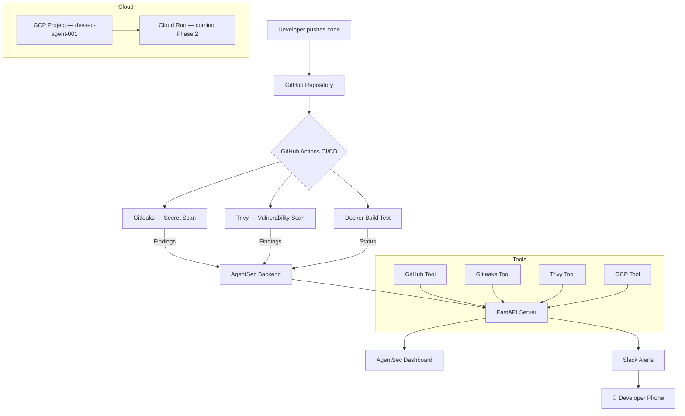
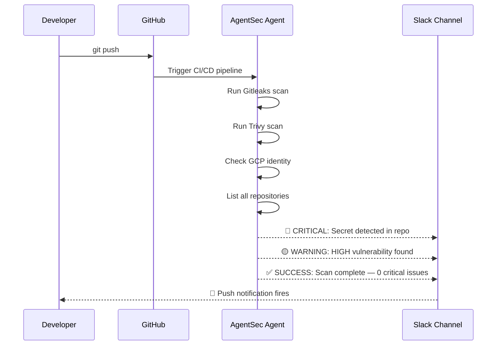
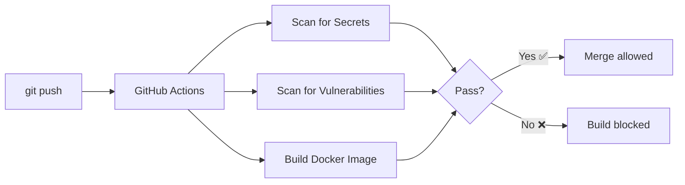

AgentSec 🛡️
Autonomous DevSecOps Agent — Powered by Uwem
> AI-powered security monitoring, secret detection, vulnerability scanning, and real-time Slack alerting across your entire GitHub and cloud infrastructure.
---
What is AgentSec?
AgentSec is an autonomous DevSecOps agent that watches your GitHub repositories and cloud infrastructure 24/7. It detects exposed secrets, scans for vulnerabilities, monitors your GCP resources, and fires real-time alerts to your Slack channel — without you lifting a finger.
Built by a DevSecOps engineer, for DevSecOps engineers.
---
Architecture — Phase 1

---
Agent Flow

---
Tech Stack
Layer	Technology	Purpose
Agent Brain	Gemini AI / Claude API	Autonomous reasoning and decision making
Backend	FastAPI + Python 3.12	API server and agent orchestration
Frontend	Next.js + TypeScript	Live monitoring dashboard
Secret Scanner	Gitleaks	Detect exposed API keys and secrets
Vulnerability Scanner	Trivy	Scan containers and filesystems
GitHub Integration	PyGitHub	Repository monitoring and scanning
Cloud	GCP (Cloud Run, IAM)	Infrastructure scanning and deployment
Alerting	Slack Webhooks	Real-time push notifications
CI/CD	GitHub Actions	Automated security pipeline on every push
Container	Docker	Portable deployment
---
Features — Phase 1
✅ GitHub Repository Monitoring — lists and monitors all your repos in real time
✅ Secret Detection — scans every file for exposed API keys, tokens, and passwords
✅ Vulnerability Scanning — detects known CVEs in your dependencies and containers
✅ GCP Cloud Identity — verifies and monitors your GCP project identity
✅ Live Dashboard — dark-themed real-time monitoring UI with animated radar
✅ Slack Alerts — instant push notifications to your phone when issues are found
✅ Docker Container — fully containerized and portable
✅ Automated CI/CD — security checks run automatically on every git push
---
Project Structure
```
agentsec/
├── backend/
│   ├── agent/
│   │   ├── core.py          # Agent brain (Gemini/Claude)
│   │   └── planner.py       # Task planning
│   ├── tools/
│   │   ├── github_tool.py   # GitHub integration
│   │   ├── gitleaks.py      # Secret scanning
│   │   ├── trivy.py         # Vulnerability scanning
│   │   ├── gcp.py           # GCP cloud scanning
│   │   └── slack.py         # Slack alerting
│   ├── api/
│   │   └── main.py          # FastAPI server
│   ├── Dockerfile
│   └── requirements.txt
├── frontend/
│   └── app/
│       ├── page.tsx         # Main dashboard
│       ├── layout.tsx       # App layout
│       └── globals.css      # AgentSec dark theme
├── .github/
│   └── workflows/
│       └── security.yml     # CI/CD security pipeline
└── README.md
```
---
Quick Start
Prerequisites
Python 3.12+
Node.js 22+
Docker
gcloud CLI
Gitleaks
Trivy
1. Clone the repo
```bash
git clone https://github.com/ashNikov/devsec-agent.git
cd devsec-agent
```
2. Set up backend
```bash
cd backend
python3 -m venv venv
source venv/bin/activate
pip install -r requirements.txt
```
3. Configure environment
```bash
cp .env.example .env
# Add your keys to .env
```
Required keys:
```
ANTHROPIC_API_KEY=your_key
GITHUB_TOKEN=your_token
GCP_PROJECT_ID=your_project_id
GOOGLE_APPLICATION_CREDENTIALS=path_to_credentials.json
GEMINI_API_KEY=your_gemini_key
SLACK_WEBHOOK_URL=your_webhook_url
```
4. Start the backend
```bash
uvicorn api.main:app --reload --port 8000
```
5. Start the frontend
```bash
cd ../frontend
npm install
npm run dev
```
6. Open the dashboard
Navigate to http://localhost:3000
---
CI/CD Security Pipeline
Every push to `main` automatically runs:

---
Roadmap
Phase 1 — Monitor ✅ 88% Complete
[x] GitHub repository monitoring
[x] Secret detection with Gitleaks
[x] Vulnerability scanning with Trivy
[x] GCP cloud identity
[x] FastAPI backend
[x] AgentSec dashboard
[x] Docker container
[x] GitHub Actions CI/CD
[x] Slack real-time alerts
[ ] Claude AI brain integration
[ ] GCP Cloud Run deployment
[ ] Automated scan scheduler
Phase 2 — Remediation 🔄 Coming Soon
[ ] Auto-rotate exposed secrets
[ ] Auto-fix IAM over-permissions
[ ] Auto-patch vulnerable dependencies
[ ] Incident response runbooks
Phase 3 — Building Agent 🔮 Planned
[ ] Provision new infrastructure
[ ] Auto-add security pipelines to repos
[ ] Write and deploy Terraform configs
[ ] Multi-cloud support (AWS + GCP)
---
Built By
Uwem Udo — DevSecOps Engineer  
GitHub: @ashNikov
> *"Security shouldn't be an afterthought. AgentSec makes it automatic."*
---
License
MIT License — feel free to use, modify, and build on this.
# AgentSec
# AgentSec
# AgentSec
# AgentSec
# AgentSec
# AgentSec
